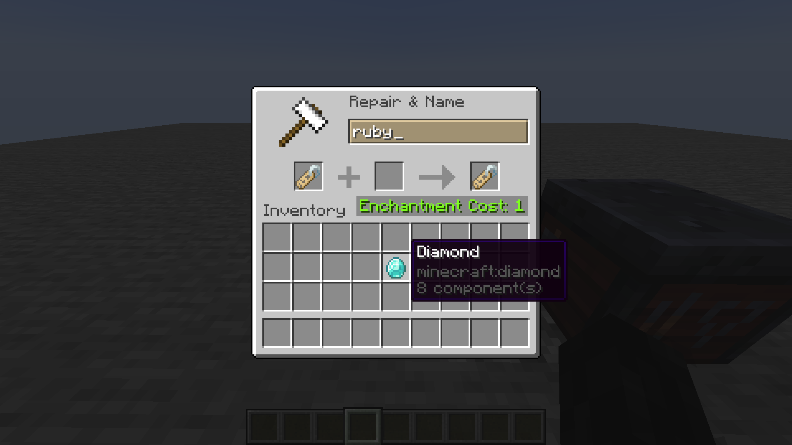
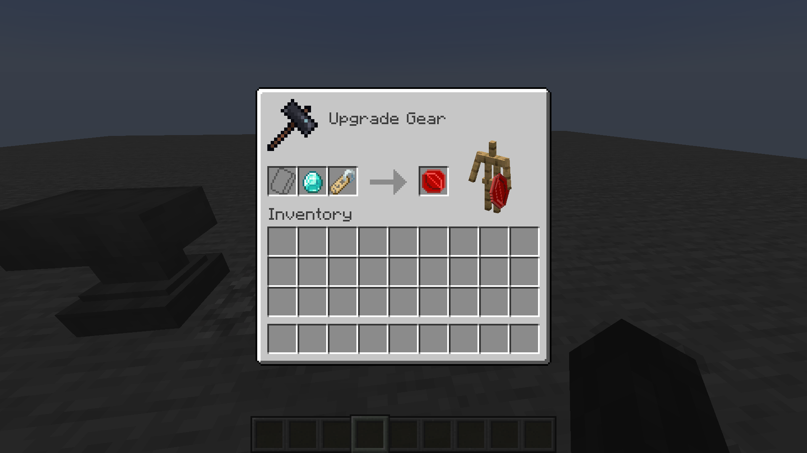
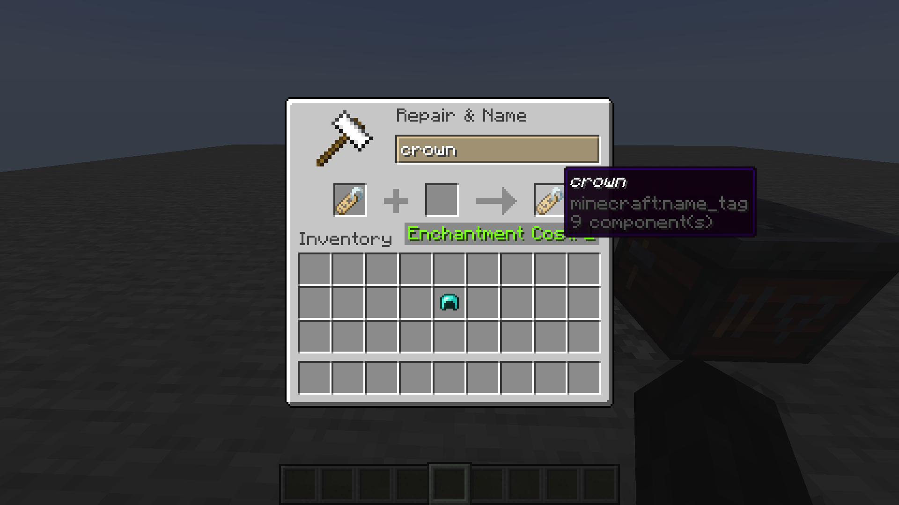
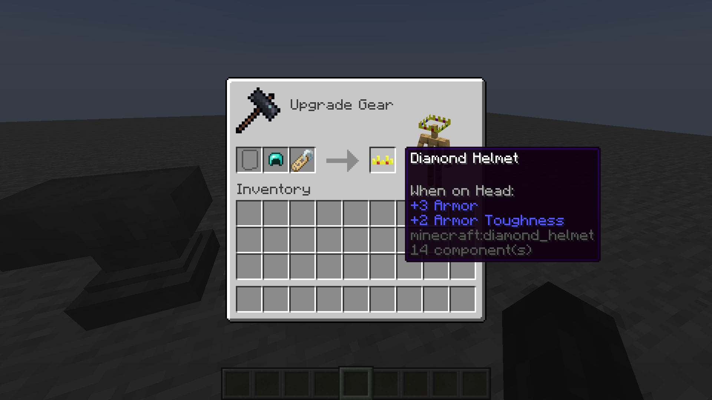
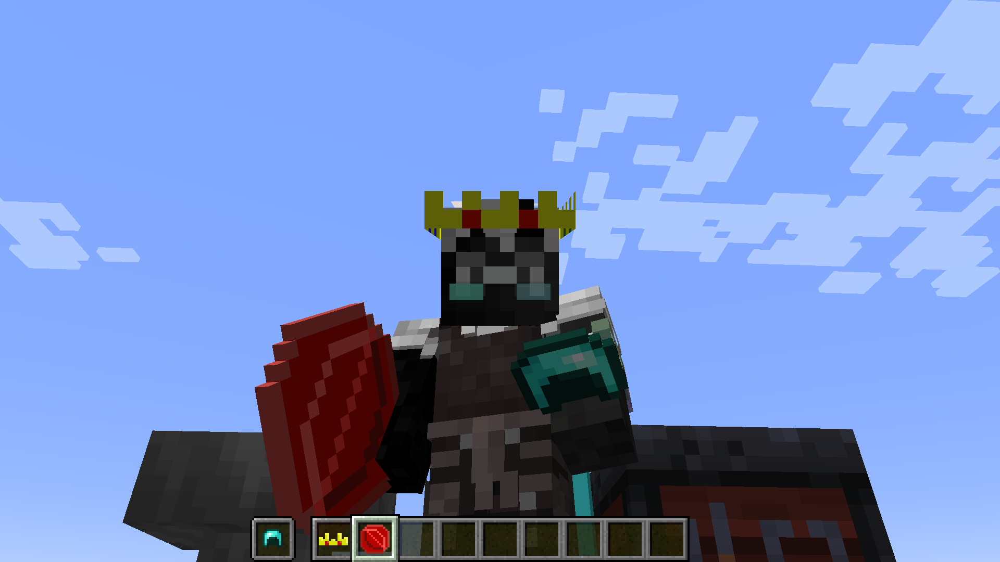

# Custom Item Models

## Setup

This modification is only needed on the server side - clients without this mod will be able to join and use all provided functionality. It also works in singleplayer if installed on client.

## Usage

To see compatible ResourcePack examples, navigate into `tutorial` directory.

Rename Name Tag on the Anvil into the `string` that you would usually put inside `minecraft:custom_model_data={strings:[]}` array.


Diamond before applying Name Tag with the title `ruby`:
```
{
    count: 1, 
    Slot: 0b, 
    id: "minecraft:diamond"
}
```

Then, apply this Name Tag onto the item via Smithing Table.


Diamond after applying Name Tag with the title `ruby`:
```
{
    count: 1, 
    Slot: 0b, 
    id: "minecraft:diamond", 
    components: {
        "minecraft:custom_model_data": {
            strings: ["ruby"]
        }
    }
}
```

This mod also changes `minecraft:equippable` component for such items as armor pieces and elytras.

for example, `Diamond Helmet` before applying Name Tag with the title `crown`:
```
{
    count: 1, 
    Slot: 0b, 
    id: "minecraft:diamond_helmet"
}
```

and after applying Name Tag with the title `crown`:
```
{
    count: 1, 
    Slot: 0b, 
    id: "minecraft:diamond_helmet", 
    components: {
        "minecraft:custom_model_data": {
            strings: ["crown"]
        }, 
        "minecraft:equippable": {
            equip_sound: "minecraft:item.armor.equip_diamond", 
            slot: "head", 
            asset_id: "cit:crown"
        }
    }
}
```


ATTENTION: Be aware that `asset_id` **will always** be under `cit` namespace, due to how vanilla code operates. You can see examples in the tutorial directory.

*You don't have to use `cit` namespace for item models, only for armor rendering.*


## License

This mod is available under the MIT license. Feel free to learn from it and incorporate it in your own projects.
